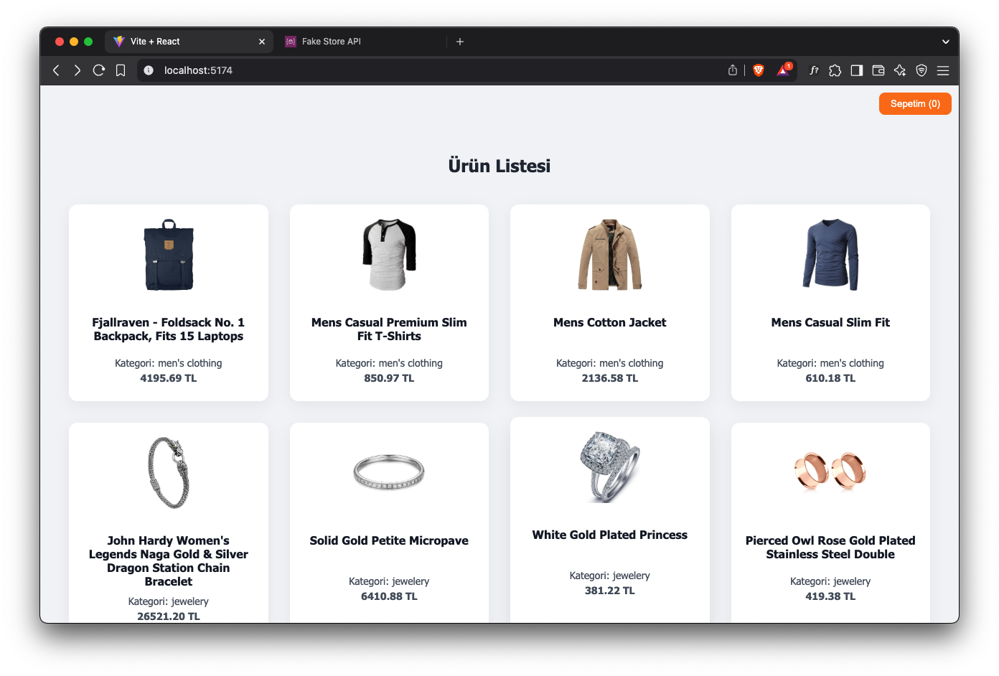
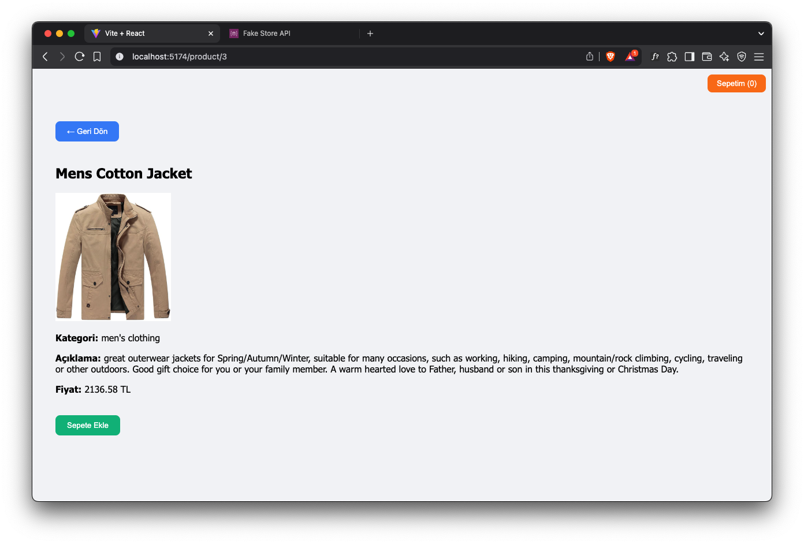
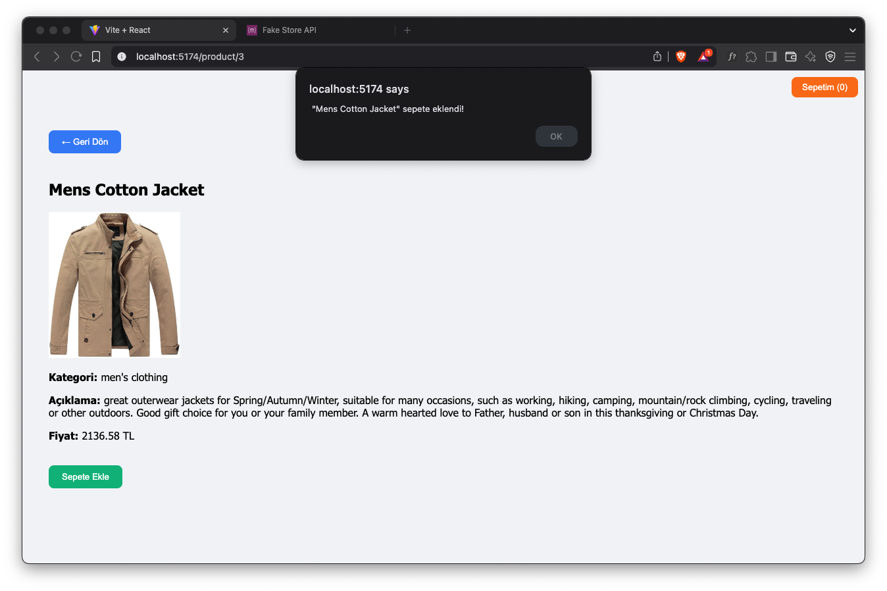
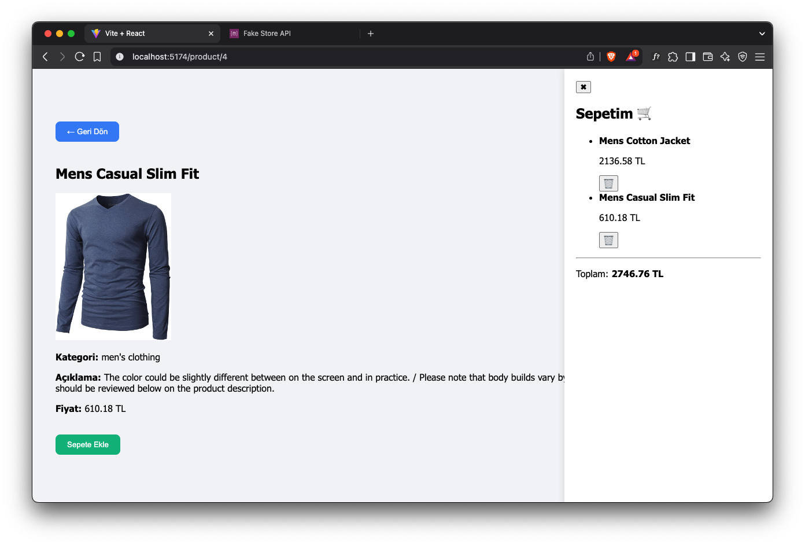

# 🛍️ React Ürün Listesi Projesi

Bu proje, [Fake Store API](https://fakestoreapi.com/) kullanılarak geliştirilmiş bir mini e-ticaret uygulamasıdır. Ürünler listelenmiş, detayları görüntülenmiş ve sepete ekleme gibi temel işlemler modern bir React yapısı ile gerçekleştirilmiştir.

> 🎓 Bu proje "Siliconmade Academy – React Eğitimi" kapsamında 9. hafta ödevi olarak hazırlanmıştır.

---

## 📌 Proje Özellikleri

- ✅ React (Vite) altyapısı ile hızlı geliştirme
- 🌍 MyMemory API ile ürün isimlerini ve kategorilerini Türkçeye çevirme
- 💰 ExchangeRate API ile USD fiyatlarını TL’ye çevirme
- 🛒 Sepete ekleme (dummy)
- 🎬 Sağdan kayan animasyonlu sepet paneli
- 🧮 Toplam fiyat hesaplama ve ürün silme
- 📱 Responsive tasarım (mobil uyumlu)

---

## 📷 Ekran Görüntüleri

### 🔹 Ürün Listesi Sayfası



### 🔹 Ürün Detay Sayfası



### 🔹 Sepete Ekleme Bildirimi



### 🔹 Sağdan Açılan Sepet Paneli



---

## 🗂️ Klasör Yapısı

```bash
urun-listesi0/
├── public/
├── src/
│   ├── assets/
│   │   ├── Screenshot1.png
│   │   ├── Screenshot2.png
│   │   ├── Screenshot3.png
│   │   └── Screenshot4.png
│   ├── components/
│   │   ├── CartPanel.jsx
│   │   ├── ProductDetail.jsx
│   ├── App.jsx
│   ├── index.css
│   └── main.jsx
├── node_modules/
├── package.json
├── README.md ✅
└── vite.config.js
```

> 🗂️ **Not:** `node_modules` klasörü bu projede **bilerek GitHub'a yüklenmemiştir**.
> 
> 📁 Bu klasör `.gitignore` dosyasıyla dışlanmıştır. Çünkü:
> 
> 1. `node_modules`, binlerce dosya içerdiği için çok yer kaplar.
> 2. Her projede farklı makinelerde yeniden kurulabilir.
> 3. Zaten `package.json` ve `package-lock.json` dosyaları, gereken paketleri tanımlar.
> 4. Projeyi çalıştırmak isteyen kişi sadece şu komutu yazarak eksik paketleri yükleyebilir:
> 
> ```bash
> npm install
> ```

## 🚀 Projeyi Başlatma

```bash
npm run dev
```

- Vite ile geliştirildiği için uygulama genellikle <http://localhost:5173> adresinde çalışır.

